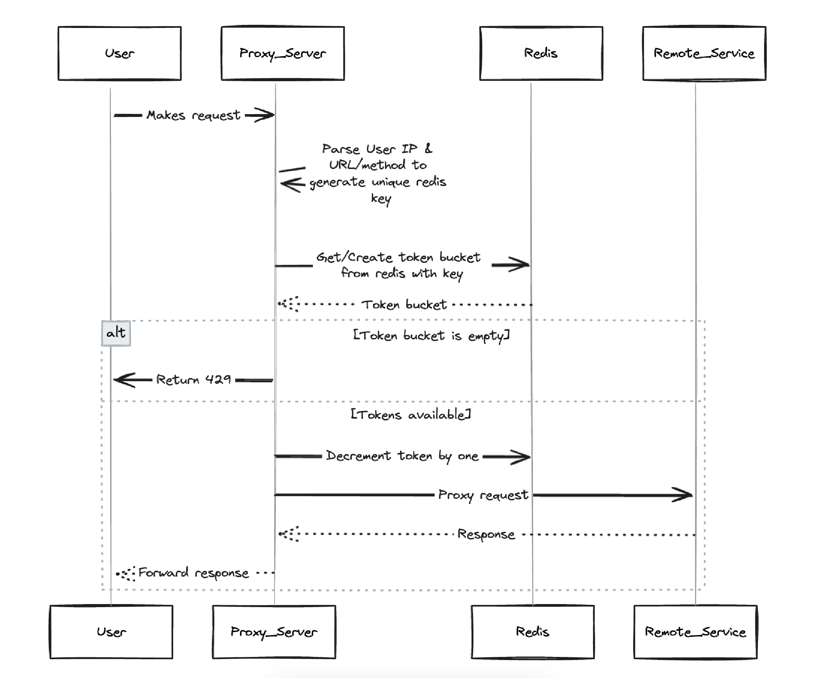

# Reverse Proxy

This service is a simple reverse proxy that can be configured to route requests to different services based on the request path. It also has a rate limiter that can be configured to limit the number of requests that can be made to a given route.

The reverse proxy implementation can be found in [cmd/proxy_server/main.go](./cmd/proxy_server/main.go), there are also two example servers that can be used to test the proxy in [cmd/server_one/main.go](./cmd/server_one/main.go) and [cmd/server_two/main.go](./cmd/server_two/main.go).


## Running the Proxy

### Prerequisites
- Docker
- Go 1.22.*
- [go-task](https://taskfile.dev/installation/)

### Running the Proxy

1. Run the docker containers, currently just redis used for rate limiting.
  ```
  docker-compose up -d
  ```
2. Run the system components, this is the proxy_server, the dummy servers one and two, and a separate process that refills token buckets in redis.
  ```
  task start-servers
  ```

### Proxy Configuration

The proxy is configured by a YAML file that is read in at startup. The configuration file is located at [./RouteDefinitions.yaml](./RouteDefinitions.yaml). 

The configuration file is a list of routes to be mounted by the proxy, and a `Target` field that specifies the address of the service that the proxy should route requests to. The `rate_limit` field specifies the rate limit for the route in requests per minute.

```yaml
  - path: "/api/goodbye"  # Route to be mounted by the proxy
    method: "GET"         # HTTP assumed to be same on both sides
    target:               # Target configuration
      host: "localhost"
      port: ":9090"
      path: "/goodbye"
    rate_limit:
      requests_per_minute: 1200 # Number of requests per minute -- ensure divisible by 60 for exact limiting
```

## Request Flow



## Future

- Add a boat load of tests including a long running integration test that hits the proxy with a bunch of requests.
- Implement an additional rate limiter that tracks a user's requests across all routes (global limit).
- Implement different rate limiting strategies that can be configured via the proxy config file.
- Look at mTLS/Ingress/Firewalls
- Dockerise and test with minikube (Services/Ingresses/NetworkPolicies)
